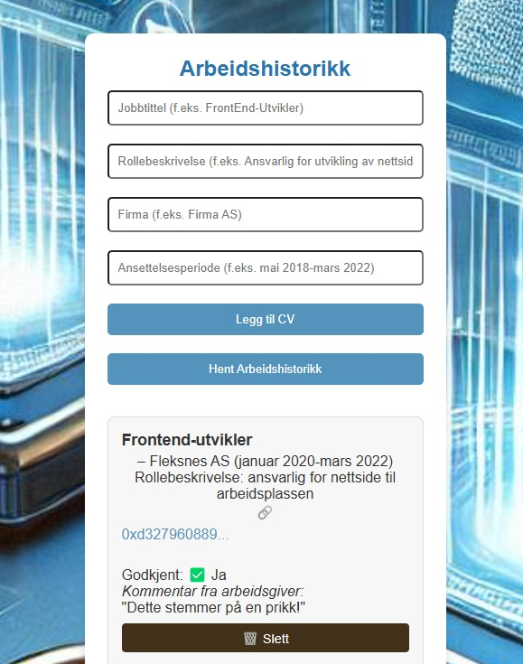

#  Fullstack Node.js DApp for verifisering av arbeidshistorikk

Dette prosjektet er en fullstack webapplikasjon utviklet med **Node.js**, **MongoDB** og **Ethereum testnett (Sepolia)**. Applikasjonen lar arbeidssøkere lagre sin arbeidshistorikk permanent på blokkjeden, og gir arbeidsgivere mulighet til å se og kommentere denne historikken via et moderne webgrensesnitt.

---

##  Teknologier brukt

- **Frontend:** HTML, CSS, JavaScript, Solidity
- **Backend:** Node.js, Express
- **Database:** MongoDB (via Mongoose)
- **Blockchain:** Ethereum testnett (Sepolia) – direkte fra MetaMask
- **Web3 bibliotek:** ethers.js / bcrypt@5.1.1 / cors@2.8.5 / dotenv@16.4.7 / axios@1.8.4 / express@4.21.2 / express-list-routes@1.2.4 / jsonwebtoken@9.0.2 / http-proxy-middleware@3.0.3 / mongodb@6.15.0 / mongoose@8.13.1 

---

##  Funksjonalitet

- **Arbeidssøkere** kan laste opp sin arbeidshistorikk (f.eks. tidligere stillinger, arbeidsgivere, perioder)
- Historikken blir skrevet til **Ethereum testnettverket (Sepolia)** for å gjøre den **urendrerbar og transparent**
- **Arbeidsgivere** har tilgang til innsendt historikk via et grensesnitt, og kan legge inn sin vurdering eller godkjenning
- Når arbeidsgiver **godkjenner eller kommenterer** historikken, lagres denne informasjonen i **MongoDB** (ikke blokkjeden)
- **Arbeidssøkeren får tilgang** til arbeidsgiverens tilbakemelding sammen med sin opplastede historikk
- Systemet skiller mellom **blokkjede-data (fra søker)** og **tilbakemeldings-data (fra arbeidsgiver i database)**
- Alt knyttes til **wallet-adresser** for eierskap, autentisering og sporbarhet

---

##  Oppsett og kjøring

### 1. Klon repoet

```bash
git clone https://github.com/OEikrem/CV-bachelor25.git
cd CV-bachelor25

2. Installer avhengigheter
npm install

3. Opprett .env-fil
Lag en .env-fil i rotmappen med følgende verdier:

MONGO_URI=din_mongodb_uri
PORT=3000
PRIVATE_KEY=din_wallet_private_key
INFURA_API_KEY=din_infura_nøkkel
(Tilpass etter ditt prosjekt)

4. Start applikasjonen
npm start
```
### Deployment
Dette prosjektet kan enkelt deployes til:

- Frontend: Vercel / Netlify
- Backend: Railway / Render / Azure App Service
- MongoDB: MongoDB Atlas

### Skjermbilder




### Lært i prosjektet
- Fullstack utvikling med Node.js, MongoDB og blockchain-integrasjon
- Hvordan bruke Ethereum (Sepolia) til å sikre uforanderlig data
- Skille mellom "off-chain" og "on-chain"-data og hvordan de henger sammen
- Praktisk bruk av skybasert database og hosting av webapp
---
Øystein Eikrem

eikrem@gmail.com

[Jeg er på LinkedIn](www.linkedin.com/in/øystein-eikrem-747876345)

---
Lisens
Dette prosjektet er åpent og fritt – bruk det som læring eller bygg videre!
